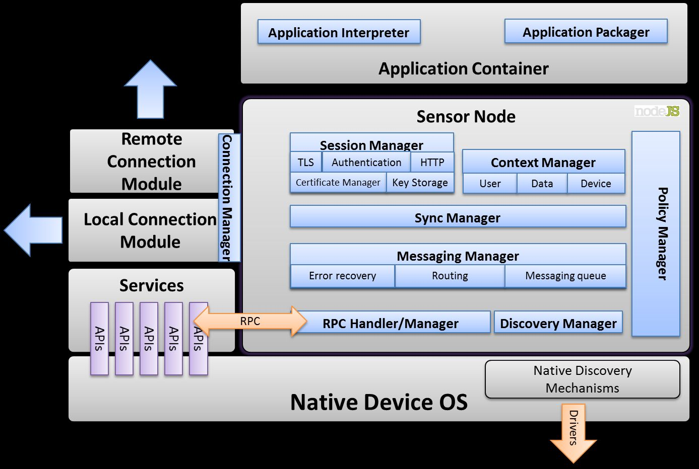
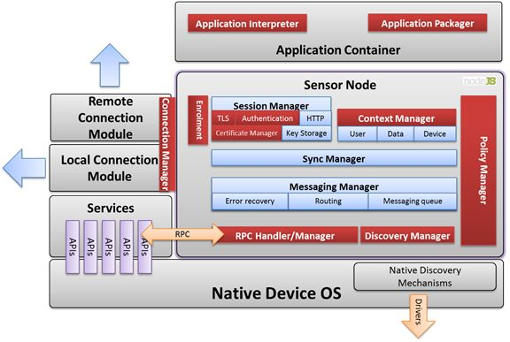
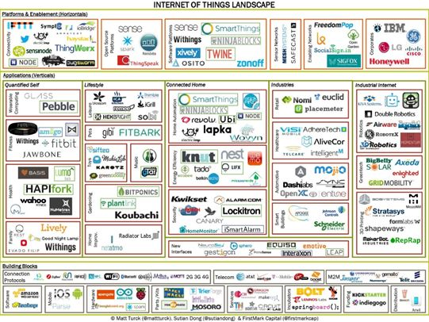

# Micro Cross Device Communication (MXD)

Technology Strategy Board: Technology-inspired innovation - ICT

# Exploitation Report

Project Manager: Nick Allott

Monitoring Officer: Simon Dawson

# 

File Ref: 101776

commercial restricted

Date:     10/4/14                            Ref:_        MXD-Exploit_  
                                Version         1.00

Circulation:

- All Project Partners
- Lead Technologist
- \_CONNECT Document Store

Contents

#Introduction
##Objective of the project

The MXD project aims to produce a secure communications platform, optimised for embedded devices that allows devices to communicate with each other over heterogeneous networks, use each others services and run interoperable service code. As such MXD is a critical enabler for Internet of Things deployments. There exist a number of technologies and protocols in the IOT and cross device space generally (CoAP, MQTT, webinos, AllJoyn, AllShare etc.) however none of these technologies provides a mechanism for managing security end to end. This is a major omission; many prototypical IOT application such as health or energy have extremely high security requirements, whether these are driven from privacy or anti-fraud concerns. Building on the state of the art, the MXD project will tackle the following challenges. Define hardware tamper-proof methods to give strong device identity, user identity and application identity and integrity mechanism. Produce an interoperable device scripting technology. Define a cross device users manageable policy framework. Deliver all these technologies on an IOT optimised code footprint  

## 2.Summary exploitation strategies

(original text from submission)

> In order to stimulate the ecosystem, jointly the MXD consortium will disseminate standardised API and protocol via the webinos open source foundation of which all three collaboration partners are full members. Separately: Copper Horse will exploit through consultancy opportunities, Oxford will exploit through academic publication and course work through the internationally recognised Cyber Security Centre. The consortium will aggressively protect essential IP through patents, to be held jointly by participants. The principle exploitation method shall be the licensing of the MXD client side code to device manufacturers. where the licensing of the code will include the requisite patent license. We have in our team a lawyer highly experience in patent protection and settlement. It may be possible to create and exploit derivative assets such as server management capabilities.

For niche markets (Health, Energy and Security Services) we shall present the technology at key conferences and engage within targeted industry for a. Mass market (a longer term objective) will be addressed though chipset vendor partnership such as ARM, Freescale, Huawei, QUALCOMM TI and Samsung.

We have already discussed the over arching concepts with Samsung, and have (without disclosing essential IPR) that there is a real requirement to be fulfilled. Under NDA they have specifically identified the joint, "security", "optimisation" and inter device "interoperability" requirements for the SmartTV market . We have been party to AllJoyn and AllShare (Samsung and QUALCOMM) discussions where these requirements have been further reinforced. At the other end of the spectrum we have had exploratory talks with TetraTab and NetMotion partner companies, who supply in vehicle computing and mobile tracking to police and emergency services. They similarly have reinforced there is a real and immediate need for reliable secure IOT connectivity stacks that can use hardware based security measures to form more trusted computing base. Exploring these specific commercial relationships, and with their competitors in relevant markets will be a primary exploitation strategy

## 3.Exploitation Routes summary

We anticipate two complementary routes for project outputs

1. a)Open Source: for non-differentiating technology required for ecosystem building we intend to exploit via publishing both code and specifications within the context of an Open Source project, namely the webinos foundation
2. b)IP and software licensing: for commercially exploitable IP assets (essential IPR and code) we intend to commercialise by licensing either or both of essential IPR and software licenses. Our collaboration agreement leaves this open as to what vehicle we use, but is likely to be a new ltd company in which principle collaborators will negotiate a share holding

# Partners

The partners of the consortium have distinct but complementary interests in the exploitation of the outputs of the project

## 1.NquiringMinds Ltd

NquiringMinds and an IOT product UbiApps. A secure IOT stack is essential to a number of market scenarios

## 2.Copper Horse Solutions Ltd

Copper Horse Solutions Ltd are security specialists offering principally consultancy services. Establishing assets and expertise in the emerging IOT sector is an essential growth strategy

## 3.The University of Oxford

# Open Source Exploitation Strategy

# Commercial Exploitation Vehicle

Commercially we currently identify two types of markets: mass market for consumer devices high volume-low margin and niche market devices, typically with and very high security requirement low volume and high margin.

#Consumer

Long term we will develop the consumer market through strategic partnerships with chipset manufactures. E,g ARM, Freescale, QUALCOMM, Samsung, TI, Gemalto, G&D. We will engage in this route when patent position is secured. NQM and CH principals as former CTO and Director of Security respectively, for one of the foremost mobile device security industry forums (OMTP) have extensive contacts and experience in working in this sector. For mass market, per device licensing fees will be subject to negotiation and typically low (between $0.05 and $0.80), but volumes can be very high

#Niche

More immediate commercial opportunities are likely to come from niche sectors, such as telematics, energy and health. Our engagement with partner companies in this space indicates at typical sales model on a per device based licensing where this license shall include device code, server management component (to administer devices) and requite IPR licenses. Our engagement with partners such as TetratTab and net motion indicates that yearly per seat licensing can range from $1.5 to $7.00 dollars per device depending on volume and market. Sales approach will be to partner strategically with system integrators that specialise on a sector by sector basis, offering them commission and the ability to upsell integration and consultancy services

For simplicity the future exploitation vehicle is likely to be a new ltd company in which the collaborators will take shares. This is easier than complex licensing deals.

The details of this will be developed in the exploitation work package.

# Technical Consultancy

All parties already provide security consultancy in one form or another.

There is not current plant to exploit consultancy opportunities collectively, but will be pursued by each party independently.

MXD public assets will however be developed with this end goal in mind and will act to support the expertise of NQM, CPH and OXF in this sector.

# Standards and Trade Bodies and Open Source

The following organisations are seen as strategic organisations to communicate MXD developments with. The detail of thes proposed collaborations will be developed as the project kicks off

 
  1. W3C
  2. GSMA
  3. Trusted Computing Group
  4. Allseen alliance
  5. Tizen
  

# Academic Conferences and Publications

It is the clear intention of the project to publish key project outputs within key academic journals.

The choice of journal and conference will depend on timing of conference, journal publication dates and technical progress. The list of candidates and progress against these goals will be recorded here.

# Academic Teaching Materials

Courses: Oxford hosts both Software and Systems Security MSC, the Cyber Security Centre and the new DTC in CyberSecurity. These are the perfect dissemination vehicle for relevant MXD findings and outputs.

Tangible progress against these objective will be recorded in this section of the exploitation report

# Conferences and Exhibitions

We plan to attend the following conferences and exhibitions with these pre-defined objectives

Mobile World Congress 2015 [http://www.mobileworldcongress.com/](http://www.mobileworldcongress.com/)

Black hat conference [https://www.blackhat.com/](https://www.blackhat.com/)

DEFCON conference [https://www.defcon.org/](https://www.defcon.org/)

This is an initial list only. This list will be developed and enhanced over time and concrete plans put in place to maximise the PR opportunities at each event as they approach

# Secure IOT Community Building

We believe that secure IOT is an under represented issue in the public arena and there is a need to form a public collaborative community to focus in these areas. We consider that the public face of the MXD project may well full this vacuum. We will put in place a concrete plan to achieve this built on the following elements

1. 
  1. 1.Website

A public website will be developed

## 2.Forum

A public forum will be created to encourage debate and discussion on these topics

## 3.Branding

We are debating within the consortium whether MXD is the best public branding for the project. When this debate resolve we will produce a formal branding set, which fill feed into all presentations and the website.

## 4.External project partners

We will develop a plan to engage external project partners. We will base this on our initial experiences with the Satellite

# Exploitation activity log

In this section we will record all key exploitation activities undertaken. Principally these will be information gathering, partnerships or dissemination activities.

## 1.Pre project launch investigations
### 1.1.Microsoft Azure – CeBit

Meetings held at cebit with Microsft IOT architecture in Europe.

Dialogue on going to document the functional and non functional requirements pertaining to secure communications stacks. See quote below from email thread with Clemens Vasters [clemensv@microsoft.com](mailto:clemensv@microsoft.com)

|  | _We're landing on TLS v1.2 with TLS/PSK RFC4279 _ [http://tools.ietf.org/html/rfc4279](http://tools.ietf.org/html/rfc4279)_ and RFC5077__I'm aiming for the _
1. 1TLS\_DHE\_PSK\_WITH\_AES\_256\_CBC\_SHA or
2. 2TLS\_PSK\_WITH\_AES\_256\_CBC\_SHA 
_profiles, in order of preference, meaning that I think the best option (1) is to use pre-shared keys with a Diffie-Hellman negotiation of session keys to be safe against replay attacks and provide perfect-forward secrecy and the (2) second best option is to use a lighter-weight and yet somewhat reasonably secure model where PSK doubles as the session key.__We believe the resulting implementation can be very lightweight since it sheds all the certificate goop and massively_ constrains the algo suite. |
| --- | --- |

### Trustonic – MWC

Meetings held at Mobile World Congress.

Trustonic is the basis of Samsung Knox BYOD solution and builds on top of ARMs trustzone. In theory it has a lot to offer MXD. However, conversations indicate that they are two years before targeting IOT like footprints, concentrating for now on phone formats.

Further, indications were give there was a 40k cost to accesig their SDK

### Oracle IOT

Meeting were held with IOT Senior Director in Oxford

No firm conclusions yet, but follow up meetings planned

### Satellite Catapult

Following on from meetings held at MWC, the members of the Satellite Catapult have indicated they would like to join the MXD project as an observer member.

# Exploitation Activity Q1

##Published paper Internet of Things Conference
The 4th International Conference on the Internet of Things (IoT 2014) will take place October 6–8, 2014 at Cambridge, MA, USA.

http://www.iot-conference.org/iot2014/ 

##W3C Web of Things Presentation

A submission was made and accepted to present at the W3C workshop on Web of Things

W3C workshops are important as they help set the programme of standardisation for the web

###sessions
09:15 Sharing experiences, use cases and requirements - moderator: Jörg Heuer
Nick Allott, NquiringMinds -- IOT interoperability using web technologies: lessons learned and future challenges [paper, slides]

11:00 Panel session on who is doing what (IoT projects and standardization bodies)
Moderator: Claes Nilsson, Sony
Richard Soley, OMG [slides]
Eric Kauz, GS1 [slides]
Mike Bergman, CEA [slides-short, slides-long]
Istvan Lajtos, GSMA [slides]
Ingo Friese, DT [slides]
Nick Allott, UbiApps [slides]

###Paper submission: 
http://www.w3.org/2014/02/wot/submissions.html

Background: this submission paper has been prepared on the back of work undertaken within the webinos project. In this project a number of parties (including Samsung, Sony Ericsson W3C, Deutsche Telekom, Telefonica, Telecom Italia, BMW, Fraunhoffer DOCOMO) collaborated on an a web framework for cross device communications, where Internet of Things devices were one of the device connected.

This platform was/is implement on open source accessible code and specifications exist for all the external interfaces required for interoperability.
Over 20 different have been adapted to this framework including heart rate monitors, thermometers, meter readers, blood sugar monitors, in vehicle sensors, thermostats, humidity monitors, etc. These device work over a variety of physical connections including, WiFi, 3G, Zigbee, 802.14, Bluetooth, ANT+, Weightless, serial port, and RF 868/4344

In this paper we make no distinction between Web of Things and Internet of Things.

**Lesson 1:** you cannot assume IP connections exist
Many real world IOT devices do not have IP connections. IOT deployment are usually a careful balance of battery, network connection and physical cost. On all these three dimensions non IP connections (e.g. RF868, Weightless, 802.14) out perform technologies with an IP connection. A solution that allows a web developer to interwork with these technologies must be able to abstract over such issues

**Lesson 2:** security is important
For many IOT deployments security is more (not less) important than mobile or desktop scenarios. Many IOT/M2M deployments underpin business models. For example black box in vehicle solutions for both insurance and asset tracking, meter readers for utility charging, or simply the obvious health privacy issues.

**Lesson 3:** but security is hard
For the reason implied by lesson 1 (no IP) but also because even if you have IP on a small footprint IOT device, often you will not have TLS connection, some of the usual assumptions you might make about connectivity security do not exist. In order to implement moderate security over a web of things, work is required to establish a baseline set of secure foundation technologies that can be applied across a wide spectrum of device footprints.

**Lesson 4:** device/service discovery
From the web developers perspective the first problem they will have is physically discovering devices and understanding the data feeds that this device can make available. There are many “technologies” that can implement this, from Bluetooth, mdns, ussp etc etc. however the web developer needs this abstracted and accessible through easy to use JavaScript functions if to be of use.

**Lesson 4:** JavaScript functional abstraction
Similarly physically accessing the data and data stream on a device, irrespective of the physical connection that the IOT device depends on should be abstracted by JavaScript. Geolocation successes and failures are instructive to look at, is this in a single instances of a single device stream from a single device. IOT sensor attachment, is in reality an generalisation of this problem.

**Lesson 5:** offline and historical data
In the real world IOT devices are not always online. A strong WOT solution needs solutions for offline caching, synchronisation and handling elegantly offline scenarios
This paper is draft only and can be extended with concrete examples and indicative solutions if successful.

We are also able to provide running demos on a wide range of IOT devices.

http://www.w3.org/2014/02/wot/

[Presentation](W3C WOT - IOT Interoperability.pdf)

[Panel position paper](W3C WOT - IOT Projects Position.pptx)

##Media Web Symposium - IOT presentation

A submission was made and accepted to present the relevance of IOT technologies to the media industry

Programme 
http://www.fokus.fraunhofer.de/en/fokus_events/fame/mediawebsymposium2014/_additional_information/MWS2014_Program.pdf

Non-proprietary multi screen applications: Seamlessly 
integrating phones and TVs using open technologies
Nick Allott, CEO, NquiringMinds

[Presentation](Non-proprietary multi screen applications MWS 2014.pdf)

##Deutsche Telekom CTO Group Workshop

A private workshop was made to DTs CTO group, which included 30 senior executives.

The workshop focussed on exploitation opportunities for operators in the IOT space.

It featured very heavily on security related issues

##### Internet of Things: The relevance for operators 

### Appendix 1.Introduction

Objective of the day: to explore potential role of operator assets in an IOT/IOE/WOT future. To highlight both opportunities and key problems that need to be addressed. To do so with some concrete worked examples, both in terms of technology and business

Scene setting:

- the evolution of IOT from M2M. 
- the defining characteristics of IOT
- the relationship of IOT to other key technologies/ user experiences 
- IOT as a disruptor of existing businesses
- IOT as an enabler of new businesses

The introduce the process for the day

- --High level presentation on IOT issues as related to MNO assets and capabilities
- --Vertical worked examples – for Building energy management and vehicle telematics respectively 
  - Scene setting: drill into market dynamics route to market and financial for this vertical 
  - Demo: a real demo showing apps, services and devices for this vertical, to contextualize the business
  - Operators asset analysis: with reference back to our identified IOT- MNO issues, drill into the detail and look at what opportunities exist, what problem need to be overcome and asses the opportunity for

- --Workshop: a brief overview of the interactive session 

### Appendix 2.Demonstrations and Presentation

#### Operator Assets and IOT issues

Approach will be to deep dive into some specific

- Radio technology: look at radio technology from a number of dimensions
  - Licensing costs
  - Power consumption
  - Coverage

- Security: look at the important of security generally
  - Fraud prevention, essential for many IOT applications
  - Privacy issues for consumers
  - Secure computing, SIM as a secure computing framework
  - Shift perspective from security as a way of reducing liabilities, to using security features as a directly monetisable asset

- Identity: as a single aspect of security, look at why it is absolutely essential for real world IOT deployments 
- Retail and device subsidy: look at the role retail channels has, and compare the model of 
- Customer service, hosting and operations: look at the need for scalable customer services, and robust hosting operations. 
- IOT devices as multiple service hosts: understand the difference between M2M and IOT. The difference between a device the suppliers one service to one organization and a device which can provide the same capability in parallel to many parties. Look at the financial imperative to amortize device cost over many services

#### Commercial Building Control (BEMS – Building Energy Management Systems)

##### Business

A high level look at the business status quo

- List of major players
- Route to market
- Pricing and value chain, and financials

##### Demo

A demo of building control using the UbiApps framework. Will try to contextualize the business in terms of application, services, showing the interfaces different stakeholder see and talking through the end users experience from different stakeholders

##### Disruption and opportunity

Re-examine this core business, with key operator assets in mind. What opportunities exist for operators, what are the problems to be overcome?

- Radio technology: whats used now for in building systems. What the price battery power impacts are of radio alternatives. Different deployment architectures
- Security:
  - Issues of fraud in energy management systems
  - A look at the management and zoning problems for multi use, multi tenancy buildings

- Identity: who owns what in a real world building. How does the technology know who knows what
- How are devices "paid for" currently. How might that change in the future
- What "other" services and systems can piggy back on a basic BEMS infrastructure

A conclusion on the opportunity for MNO disruption and issues that need to be solved from an MNO perspective

#### Telematics

##### Business

Telematics is big area – well look at from primarily from an mobile asset tracking perspective, and touch on some of the derivative businesses e.g. insurance + logistics (might just focus on one, will review when we get to next level of detail

A high level look at the business status quo

- List of major players
- Route to market
- Pricing and value chain, and financials

##### Demo

Using the UbiApps framework will look at a basic delivery logistics application, with the real time feeds that IOT enables

On the device side we will look at different deployment scenarios

- Mobile phone only 
- Mobile phone plus black box (GPS only)
- Mobile phone plus black box + ODB2 
- Black box GPS + ODB2 + built in sensors 

##### Disruption and opportunity

With respect to different device configurations will look at the following

Radio: different ways of getting the data back to server. Costs and impacts

Security:

- --Look at the risk exposure, fraud option for different deployment models and understand how this can be critical 

Devices: look at device subsidy models and retail models. Current and predicted

Service sharing: sharing device costs across multiple services. Identifying sweet spots

### Appendix 3.Workshops

Having run through these concrete scenarios we will now break down into groups to repeat and extend

#### Telematics group

This group will pick up and extend the work presented on telematics:

Objective

- --Critique the analysis that has been presented 
- --Solve or address the key issues raised
- --Derive new or refined concrete business opportunities for this sector 

#### Commercial Building Control Group

This group will pick up and extend the work presented on telematics:

Objective

- --Critique the analysis that has been presented 
- --Solve or address the key issues raised
- --Derive new or refined concrete business opportunities for this sector 

#### Brainstorm group for MNO assets

This group will refine the list of assets identified, and identify new ones - what was missed

#### Brainstorm group for new verticals

This group will be tasked to create a list of new vertical (not telematics or building control) for which and IOT business opportunity exists, analyses out across the critical dimensions

#### Optional extra groups

Depending on number of attendees and optimal group size, we create new vertical analysis groups .e.g

- Health and health care
- Domestic control 
- Warehousing and asset management etc.

### Appendix 4.Conclusions

As fall back well prepare some probable conclusions, to keep in reserve, but as far as possible we shall let these naturally emerge from the workshop session. 

[Presentation](DT CTO Workshop - demo screenshots.pdf)

##ARM meeting

Held in cambridge
Follow up meeting to be arranged

# Appendix 1.Strategic Background

## Nature of Problem

The following diagram represents a typical architecture for an internet enabled device which contains both local application execution capability and remote service discovery and invocation. Typical requirements for and IOT device. This reference architecture has been published broadly in both internet fora and academic journals. And one to which most existing connected devices architecture conform, including ChromeOS, FirefoxOS Tizen and WebOS

 
 
[http://link.springer.com/chapter/10.1007%2F978-3-642-36632-1\_24](http://link.springer.com/chapter/10.1007%2F978-3-642-36632-1_24)

Current reference implementation of such and architecture exist on many platforms: Windows, Mac, Linux, Android etc. All implementations to date have a typical install and in use memory footprint of < 2.5 Mb.

A typical IOT deployment by contrast has a hard limit of <32/64 Kb

If we review this architecture in light of this implementation constraint, we can identify many components that are simply too large to be currently ported to these constrained devices . Note this review work has been done in collaboration with Samsungs European Research Centre. In the architecture below these component have been highlighted in red.

 
More verbosely, we will summarise element by element the component, the implementation limitation and re-iterate the core requirement it fulfils.

## Proposition

The over aching proposition is to provide patent protected software stack optimised for IOT deployments that provides hardware level, tamper proof security assurances, remote security management and interoperable local application execution and remote service attachment.

In detail this will require optimisation and innovation on the following components

1. Policy enforcement and description: the current XACML protocols are too complex to parse and too generic for IOT. Constrained profiles need to be defined with optimised, easy to parse descriptions.
2. Policy synchronisation: in a distributed IOT environment, core data such as position or heart rate can be provided by many sensors. A security model that makes sense must synchronise policy between all providers to stop data leakage. Synchronisation algorithms developed for PC are not viable for IOT and need to be redesigned.
3. Policy management: one of the most significant impediments to IOT deployment in the current climate are potential privacy concerns. The way to underwrite these concerns is to give consumer the tools to control data access. With the massive diversity of IOT devices possible it is essential for this to scale for IOT devices to share motions of privacy and policy management. Defining these mechanisms and making them accessible, in an unimpeded way to all IOT developers will be essential to IOT ecosystem success. Therefore this element we plan to build and evolve existing open source, and take non proprietary inclusive route to technology development 
4. RPC and discovery: current popular discovery and invocation mechanisms tend to be text based e.g. HTTP, REST and JSON. These protocols are bloated and hard to parse on constrained devices. Raw binary symmetric protocols are required that have more deterministic parsing properties .E.g. BSON.
5. TLS and session security generally is in standard form again to heavy both computationally and footprint-wise for IOT. Lightweight IOT encryption is required based on pre-shared key or other mechanism to be defined. 
6. Application interpretation and packaging: an IOT devices without remote programmable capability has a severely restricted shelf life, due to rapid obsolescence, and is much less flexible generally. Full JVMs of JavaScript interpreters are too heavy for IOT. Lightweight micro interpreters are the way to go, but these needs to be supported by cryptographically secure application package attestation. 
7. Hardware assurance: many of the elements discussed above, such as private key storage, and software attestation need to be underpinned with hardware level security where available to give a trusted software base for the IOT device (to stop IOT hacking). Flexible framework need to be defined that give a continuum of support from fully fledged TPMs (Trusted Platform Modules) to more lightweight solutions and diverse secure elements and trusted execution environments.

The project has been divided into distinct but complementary elements, partly to hedge against the risk of being unable to appropriately solve any one of the component optimisation problems. Each element could have exploitation potential in its own right

## 5.Market Dynamics

The following diagram produced by tech crunch provides a useful high level overview of the current status of the IOT ecosystem.

[http://techcrunch.com/2013/05/25/making-sense-of-the-internet-of-things/](http://techcrunch.com/2013/05/25/making-sense-of-the-internet-of-things/)

If we example closely the "Building Blocks" and "Platform Enablement" sectors that are application to horizontal technology, it appear there are no significant players addressing the client side software stack element, nor the high level IOT independent security assurance element. This is interesting, because if we compare this to more established areas such as mobile or broadcast (TV) technologies, it is the suppliers of these technologies that have proven to be one of the principle drivers for the entire industry.

**Top line industry figures**

Reports of the global size of the IOT industry are enormous from CISCOs claims of "25 billion devices connected to the Internet" and market size of "14.4 trillion for companies and industries worldwide in the next decade" [http://postscapes.com/internet-of-things-market-size](http://postscapes.com/internet-of-things-market-size) through to IDCs more recent predictions of "$8.9 trillion by 2020," [http://www.idc.com/getdoc.jsp?containerId=prUS24366813](http://www.idc.com/getdoc.jsp?containerId=prUS24366813). These are interesting figures but essentially meaningless unless it can be clearly identified what precise roll is going to be played in the value chain, what proportion of the overall value can be harnessed by this component, and how this technology can competitively fair against competition in this sector.

Whilst we feel confident that

1. Historically, drawing on experience of other industries Security and optimised device side stacks have and economically important roll to play in this sector 
2. And: we possess in house expertise and developed assets that will allow us to compete favourably in this sector 

True market opportunity is better evaluated by looking at the detail of the exploitation plans