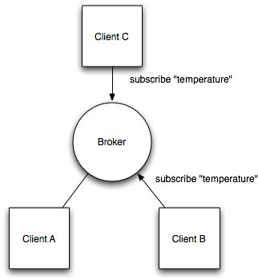
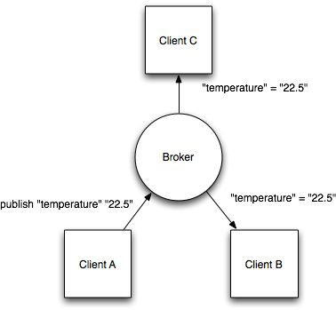

#Protocols in scope
* MQTT
* CoAP
* XMPP
* DDS
* AMQP

#MQTT

IBM sponsored protocol for IOT data transmission. Notable also for being the messaging protocol that underpins facebook messenger

MQTT[1] is a publish-subscribe based "light weight" messaging protocol for use on top of the TCP/IP protocol. It is designed for connections with remote locations where a "small code footprint" is required and/or network bandwidth is limited. The Publish-Subscribe messaging pattern requires a message broker. The broker is responsible for distributing messages to interested clients based on the topic of a message. Andy Stanford-Clark and Arlen Nipper Cirrus Link Solutions authored the first version of the protocol.

The specification does not specify the meaning of "small code foot print" or the meaning of "limited network bandwidth". Thus the protocol's availability for use will depend on the specific context. In 2013 IBM submitted MQTT v 3.1 to the OASIS specification body with a charter that ensured only minor changes to the specification could be accepted.[2] MQTT-S [3] is a variation of the main protocol aimed at embedded devices on non-TCP/IP networks, such as ZigBee.

Historically, the 'MQ' in 'MQTT' came from IBM's MQ message queuing product line.[4] However, queuing per se is not required to be supported as a standard feature in all situations.[5]

Other protocols that may be used include the IETF Constrained Application Protocol[6] and XMPP.[7][8]

[MTQQ-SN spec](http://mqtt.org/new/wp-content/uploads/2009/06/MQTT-SN_spec_v1.2.pdf)

#CoAP

IETF specification on internet of things 

http://en.wikipedia.org/wiki/Constrained_Application_Protocol

**Constrained Application Protocol (CoAP)** is a software protocol intended to be used in very simple electronics devices that allows them to communicate interactively over the Internet. It is particularly targeted for small low power sensors, switches, valves and similar components that need to be controlled or supervised remotely, through standard Internet networks. CoAP is an application layer protocol that is intended for use in resource-constrained internet devices, such as WSN nodes. CoAP is designed to easily translate to HTTP for simplified integration with the web, while also meeting specialized requirements such as multicast support, very low overhead, and simplicity.[1][2] Multicast, low overhead, and simplicity are extremely important for Internet of Things (IoT) and Machine-to-Machine (M2M) devices, which tend to be deeply embedded and have much less memory and power supply than traditional internet devices have. Therefore, efficiency is very important. CoAP can run on most devices that support UDP or a UDP analogue.

The Internet Engineering Task Force (IETF) Constrained RESTful environments (CoRE) Working Group has done the major standardization work for this protocol. In order to make the protocol suitable to IoT and M2M applications, various new functionalities have been added.[3] The core of the protocol is specified in RFC 7252, important extensions are in various stages of the standardization process.

#MQTT CoAP comparison

The IoT needs standard protocols.
Two of the most promising for small devices are MQTT and CoAP.

Both MQTT and CoAP:
- - Are open standards
- Are better suited to constrained environments than HTTP
- Provide mechanisms for asynchronous communication
- Run on IP
- Have a range of implementations
- MQTT gives flexibility in communication patterns and acts purely as a pipe for binary data.
- CoAP is designed for interoperability with the web.

##MQTT
MQTT is a publish/subscribe messaging protocol designed for lightweight M2M communications. It was originally developed by IBM and is now an open standard.

###Architecture
MQTT has a client/server model, where every sensor is a client and connects to a server, known as a broker, over TCP.

MQTT is message oriented. Every message is a discrete chunk of data, opaque to the broker.

Every message is published to an address, known as a topic. Clients may subscribe to multiple topics. Every client subscribed to a topic receives every message published to the topic.

For example, imagine a simple network with three clients and a central broker.

All three clients open TCP connections with the broker. Clients B and C subscribe to the topic temperature.

At a later time, Client A publishes a value of 22.5 for topic temperature. The broker forwards the message to all subscribed clients.

The publisher subscriber model allows MQTT clients to communicate one-to-one, one-to-many and many-to-one.

###Topic matching
In MQTT, topics are hierarchical, like a filing system (eg. kitchen/oven/temperature). Wildcards are allowed when registering a subscription (but not when publishing) allowing whole hierarchies to be observed by clients.

The wildcard + matches any single directory name, # matches any number of directories of any name.

For example, the topic kitchen/+/temperature matches kitchen/foo/temperature but not kitchen/foo/bar/temperature

kitchen/# matches kitchen/fridge/compressor/valve1/temperature

###Application Level QoS
MQTT supports three quality of service levels, “Fire and forget”, “delivered at least once” and “delivered exactly once”.

###Last Will And Testament
MQTT clients can register a custom “last will and testament” message to be sent by the broker if they disconnect. These messages can be used to signal to subscribers when a device disconnects.

###Persistence
MQTT has support for persistent messages stored on the broker. When publishing messages, clients may request that the broker persists the message. Only the most recent persistent message is stored. When a client subscribes to a topic, any persisted message will be sent to the client.

Unlike a message queue, MQTT brokers do not allow persisted messages to back up inside the server.

###Security
MQTT brokers may require username and password authentication from clients to connect. To ensure privacy, the TCP connection may be encrypted with SSL/TLS.

###MQTT-SN
Even though MQTT is designed to be lightweight, it has two drawbacks for very constrained devices.

Every MQTT client must support TCP and will typically hold a connection open to the broker at all times. For some environments where packet loss is high or computing resources are scarce, this is a problem.

MQTT topic names are often long strings which make them impractical for 802.15.4.

Both of these shortcomings are addressed by the MQTT-SN protocol, which defines a UDP mapping of MQTT and adds broker support for indexing topic names.

##CoAP
CoAP is the Constrained Application Protocol from the CoRE (Constrained Resource Environments) IETF group.

###Architecture
Like HTTP, CoAP is a document transfer protocol. Unlike HTTP, CoAP is designed for the needs of constrained devices.

CoAP packets are much smaller than HTTP TCP flows. Bitfields and mappings from strings to integers are used extensively to save space. Packets are simple to generate and can be parsed in place without consuming extra RAM in constrained devices.

CoAP runs over UDP, not TCP. Clients and servers communicate through connectionless datagrams. Retries and reordering are implemented in the application stack. Removing the need for TCP may allow full IP networking in small microcontrollers. CoAP allows UDP broadcast and multicast to be used for addressing.

CoAP follows a client/server model. Clients make requests to servers, servers send back responses. Clients may GET, PUT, POST and DELETE resources.

CoAP is designed to interoperate with HTTP and the RESTful web at large through simple proxies.

Because CoAP is datagram based, it may be used on top of SMS and other packet based communications protocols.

###Application Level QoS
Requests and response messages may be marked as “confirmable” or “nonconfirmable”. Confirmable messages must be acknowledged by the receiver with an ack packet.

Nonconfirmable messages are “fire and forget”.

###Content Negotiation
Like HTTP, CoAP supports content negotiation. Clients use Accept options to express a preferred representation of a resource and servers reply with a Content-Type option to tell clients what they’re getting. As with HTTP, this allows client and server to evolve independently, adding new representations without affecting each other.

CoAP requests may use query strings in the form ?a=b&c=d. These can be used to provide search, paging and other features to clients.

###Security
Because CoAP is built on top of UDP not TCP, SSL/TLS are not available to provide security. DTLS, Datagram Transport Layer Security provides the same assurances as TLS but for transfers of data over UDP. Typically, DTLS capable CoAP devices will support RSA and AES or ECC and AES.

###Observe
CoAP extends the HTTP request model with the ability to observe a resource. When the observe flag is set on a CoAP GET request, the server may continue to reply after the initial document has been transferred. This allows servers to stream state changes to clients as they occur. Either end may cancel the observation.

###Resource Discovery
CoAP defines a standard mechanism for resource discovery. Servers provide a list of their resources (along with metadata about them) at /.well-known/core. These links are in the application/link-format media type and allow a client to discover what resources are provided and what media types they are.

###NAT Issues
In CoAP, a sensor node is typically a server, not a client (though it may be both). The sensor (or actuator) provides resources which can be accessed by clients to read or alter the state of the sensor.

As CoAP sensors are servers, they must be able to receive inbound packets. To function properly behind NAT, a device may first send a request out to the server, as is done in LWM2M, allowing the router to associate the two. Although CoAP does not require IPv6, it is easiest used in IP environments where devices are directly routable.

###Comparison
MQTT and CoAP are both useful as IoT protocols, but have fundamental differences.

MQTT is a many-to-many communication protocol for passing messages between multiple clients through a central broker. It decouples producer and consumer by letting clients publish and having the broker decide where to route and copy messages. While MQTT has some support for persistence, it does best as a communications bus for live data.

CoAP is, primarily, a one-to-one protocol for transferring state information between client and server. While it has support for observing resources, CoAP is best suited to a state transfer model, not purely event based.

MQTT clients make a long-lived outgoing TCP connection to a broker. This usually presents no problem for devices behind NAT. CoAP clients and servers both send and receive UDP packets. In NAT environments, tunnelling or port forwarding can be used to allow CoAP, or devices may first initiate a connection to the head-end as in LWM2M.

MQTT provides no support for labelling messages with types or other metadata to help clients understand it. MQTT messages can be used for any purpose, but all clients must know the message formats up-front to allow communication. CoAP, conversely, provides inbuilt support for content negotiation and discovery allowing devices to probe each other to find ways of exchanging data.

Both protocols have pros and cons, choosing the right one depends on your application.

Do experiments, build prototypes and deploy test devices on networks.

#XMPP

XMPP was originally called “Jabber.” It was developed for instant messaging (IM) to connect people to other people via text messages (Fig. 4). XMPP stands for Extensible Messaging and Presence Protocol. Again, the name belies the targeted use: presence, meaning people are intimately involved.

XMPP uses the XML text format as its native type, making person-to-person communications natural. Like MQTT, it runs over TCP, or perhaps over HTTP on top of TCP. Its key strength is a name@domain.com addressing scheme that helps connect the needles in the huge Internet haystack.

In the IoT context, XMPP offers an easy way to address a device. This is especially handy if that data is going between distant, mostly unrelated points, just like the person-to-person case. It’s not designed to be fast. In fact, most implementations use polling, or checking for updates only on demand. A protocol called BOSH (Bidirectional streams over Synchronous HTTP) lets severs push messages. But “real time” to XMPP is on human scales, measured in seconds.

XMPP provides a great way, for instance, to connect your home thermostat to a Web server so you can access it from your phone. Its strengths in addressing, security, and scalability make it ideal for consumer-oriented IoT applications.

# DDS

In contrast to MQTT and XMPP, the Data Distribution Service (DDS) targets devices that directly use device data. It distributes data to other devices (Fig. 5). While interfacing with the IT infrastructure is supported, DDS’s main purpose is to connect devices to other devices. It is a data-centric middleware standard with roots in high-performance defense, industrial, and embedded applications. DDS can efficiently deliver millions of messages per second to many simultaneous receivers.

Devices demand data very differently than the IT infrastructure demands data. First, devices are fast. “Real time” is often measured in microseconds. Devices need to communicate with many other devices in complex ways, so TCP’s simple and reliable point-to-point streams are far too restrictive. Instead, DDS offers detailed quality-of-service (QoS) control, multicast, configurable reliability, and pervasive redundancy. In addition, fan-out is a key strength. DDS offers powerful ways to filter and select exactly which data goes where, and “where” can be thousands of simultaneous destinations. Some devices are small, so there are lightweight versions of DDS that run in constrained environments.

Hub-and-spoke is completely inappropriate for device data use. Rather, DDS implements direct device-to-device “bus” communication with a relational data model. RTI calls this a “DataBus” because it is the networking analog to a database. Similar to the way a database controls access to stored data, a data bus controls data access and updates by many simultaneous users. This is exactly what many high-performance devices need to work together as a single system.

High-performance integrated device systems use DDS. It is the only technology that delivers the flexibility, reliability, and speed necessary to build complex, real-time applications. Applications include military systems, wind farms, hospital integration, medical imaging, asset-tracking systems, and automotive test and safety. DDS connects devices together into working, distributed applications at physics speeds.

#AMQP

Finally, the Advanced Message Queuing Protocol (AMQP) is sometimes considered an IoT protocol. AMQP is all about queues (Fig. 6). It sends transactional messages between servers. As a message-centric middleware that arose from the banking industry, it can process thousands of reliable queued transactions.

AMQP is focused on not losing messages. Communications from the publishers to exchanges and from queues to subscribers use TCP, which provides strictly reliable point-to-point connection. Further, endpoints must acknowledge acceptance of each message. The standard also describes an optional transaction mode with a formal multiphase commit sequence. True to its origins in the banking industry, AMQP middleware focuses on tracking all messages and ensuring each is delivered as intended, regardless of failures or reboots.

AMQP is mostly used in business messaging. It usually defines “devices” as mobile handsets communicating with back-office data centers. In the IoT context, AMQP is most appropriate for the control plane or server-based analysis functions.

#General discussions 

Interesting discussion on power consumption in idle MQTT connections:

[MQTT Power consumption issues](http://stephendnicholas.com/archives/219)

[Useful survey of issues implementing end-to-end security on constrained devices](http://tools.ietf.org/html/draft-aks-crypto-sensors-01)

#MQTT debate 

[MQTT Part 1](mtqq-1-vasters)

[MQTT Part 2](mtqq-2-vasters)

[MQTT Part 3](mtqq-3-vasters)

#Misc Proprietary protocols 
(taken from wikipedia) 

##Process automation protocols[edit]
AS-i – Actuator-sensor interface, a low level 2-wire bus establishing power and communications to basic digital and analog devices
BSAP – Bristol Standard Asynchronous Protocol, developed by Bristol Babcock Inc.
CC-Link Industrial Networks – Supported by the CLPA
CIP (Common Industrial Protocol) – can be treated as application layer common to DeviceNet, CompoNet, ControlNet and EtherNet/IP
Controller Area Network utilised in many network implementations, including CANopen and DeviceNet
ControlNet – an implementation of CIP, originally by Allen-Bradley
DeviceNet – an implementation of CIP, originally by Allen-Bradley
DF-1 - used by Allen-Bradley PLC-5, SLC-500, and MicroLogix class devices
DirectNet – Koyo / Automation Direct[1] proprietary, yet documented PLC interface
EtherCAT
Ethernet Global Data (EGD) – GE Fanuc PLCs (see also SRTP)
EtherNet/IP – IP stands for "Industrial Protocol". An implementation of CIP, originally created by Rockwell Automation
Ethernet Powerlink – an open protocol managed by the Ethernet POWERLINK Standardization Group (EPSG).
FINS, Omron's protocol for communication over several networks, including ethernet.
FOUNDATION fieldbus – H1 & HSE
HART Protocol
HostLink Protocol, Omron's protocol for communication over serial links.
Interbus, Phoenix Contact's protocol for communication over serial links, now part of PROFINET IO
MACRO Fieldbus - "Motion and Control Ring Optical" developed by Delta Tau Data Systems.
MECHATROLINK – open protocol originally developed by Yaskawa.
MelsecNet, supported by Mitsubishi Electric.
Modbus PEMEX
Modbus Plus
Modbus RTU or ASCII or TCP
OSGP – The Open Smart Grid Protocol, a widely use protocol for smart grid devices built on ISO/IEC 14908.1
Optomux – Serial (RS-422/485) network protocol originally developed by Opto 22 in 1982. The protocol was openly documented[2] and over time used for industrial automation applications.
PieP – An Open Fieldbus Protocol
Profibus – by PROFIBUS International.
PROFINET IO
RAPIEnet – Real-time Automation Protocols for Industrial Ethernet
Honeywell SDS – Smart Distributed System – Originally developed by Honeywell. Currently supported by Holjeron.
SERCOS III, Ethernet-based version of SERCOS real-time interface standard
SERCOS interface, Open Protocol for hard real-time control of motion and I/O
GE SRTP – GE Fanuc PLCs
Sinec H1 – Siemens
SynqNet – Danaher
TTEthernet – TTTech

##Industrial control system protocols[edit]
MTConnect
OPC
OPC UA

##Building automation protocols[edit]
1-Wire – from Dallas/Maxim
BACnet – for building automation, designed by committee ASHRAE.
C-Bus
CC-Link Industrial Networks, supported by Mitsubishi Electric
DALI
DSI
Dynet
EnOcean – Low Power Wireless protocol for energy harvesting and very lower power devices.
KNX – previously AHB/EIB
LonTalk – protocol for LonWorks technology by Echelon Corporation
Modbus RTU or ASCII or TCP
oBIX
HDL-Bus- main protocol for HDL home automation system.
VSCP
xAP – Open protocol
X10 – Open industry standard
ZigBee – Open protocol
INSTEON

##Power system automation protocols[edit]
DNP3 – Distributed Network Protocol
IEC 60870-5
IEC 61850
IEC 62351 – Security for IEC 60870, 61850, DNP3 & ICCP protocols
Automatic meter reading protocols[edit]
ANSI C12.18
DLMS/IEC 62056
IEC 61107
M-Bus
ZigBee Smart Energy 2.0
Modbus

##Automobile / Vehicle protocol buses[edit]
Controller Area Network (CAN) – an inexpensive low-speed serial bus for interconnecting automotive components
DC-BUS[3] – automotive power-line communication multiplexed network
FlexRay – a general purpose high-speed protocol with safety-critical features
IDB-1394
IEBus
J1708 – RS-485 based SAE specification used in commercial vehicles, agriculture, and heavy equipment.
J1939 and ISO11783 – an adaptation of CAN for agricultural and commercial vehicles
Keyword Protocol 2000 (KWP2000) – a protocol for automotive diagnostic devices (runs either on a serial line or over CAN)
Local Interconnect Network (LIN) – a very low cost in-vehicle sub-network
Media Oriented Systems Transport (MOST) – a high-speed multimedia interface
SMARTwireX
Vehicle Area Network (VAN)

# Conclusions

* There are many protocols open and proprietary in teh IOT space
* For Open future looking IOT protocols MQTT and CoAP are pre-eminant
* Both protocols deal with security very badly
* Many real world IOT deployments do not even work on IP networks (see connection landscape)
* There is a real and immediate need to address security in an robust interoperable way for the future success of IOT technologies 

