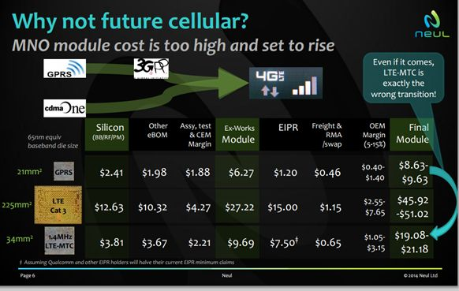

# Performance

The performance requirements parametrise certain key features on the underlying hardware

They are informed to a large extent form the hardware and radio analysis performed in the landscape analysis

## CPU requirements

Speed alone is an imperfect measure as the practical utility of the the microprocessor is a factor of the clock set and the the sophistication of the instruction set.

The prototypical CPU to be found in a IOT like system is represented by the TI 8051 family of chipsets

Microcontrollers
Parametric	MSC	USB
MHz	33	Up to 60
MIPS	8	Up to 30
Architecture	8-bit	8-bit
Code Space	Up to 32 kB Flash	Up to 32 kB RAM
RAM	Up to 1.2 kB	Up to 40 kB
ADC Channels	Up to 8	-
ADC Resolution	24-bits	-
DAC Channels	Up to 4	-
DAC Resolution	16-bits	-
Vref	Yes	-
Serial Interfaces	SPI, I2C, USART	USB, I2C, RS232, IrDA
Pricing (1KU)	$4.60 - $20.95	$1.15 - $5.10

This is a 33mhz chipset capability of processing 8 million instructions per second

For the purposes of picosec implementation we will consider 20MHz to  be a minimal practical chip clock speed we will consider.

? 8MHz

## Memory requirements
Memory is required for:
* Code execution and long term data storage: typically flash RAM
* Working memory for executing code: SRAM

The security requirements for picosec raise the barrier higher than it typical for many IOT devices

We are setting our initial requirement at

1. FlashRAM: 64k
2. SRAM: 16k

Once we have have a working system, we many attempt to lower these initial requirements.

## Power requirements

Power is probably the most important facet of a working iot system.

Power determines how frequently a battery needs replacing. In many practical deployments the human costs of battery replacement, exceed the cost of the device, and in effect is the primary costs of the device.

We need to be looking at battery life of over 1 year.

A typical 9V battery has a storage of 450mAh
http://hwstartup.wordpress.com/2013/03/11/how-to-run-an-arduino-on-a-9v-battery-for-weeks-or-months/

An typical AA alkaline battery has between 1800–2600 mAh
http://en.wikipedia.org/wiki/AA_battery

For radio 20-30uA

##Networking requirements

Putting aside the power consumption constraints of the radio technology, it is clear that an IOT device needs to connect.

Based upon our landscape analysis, we should consider all of these connections mechanisms in scope, accepting of course we do not have to implement all of them

* 802.11 - normal WIFI http://en.wikipedia.org/wiki/IEEE_802.11
* Bluetooth - http://en.wikipedia.org/wiki/Bluetooth with the following profiles
	* Serial http://en.wikipedia.org/wiki/Bluetooth_profile#Serial_Port_Profile_.28SPP.29
	* PAN http://en.wikipedia.org/wiki/Bluetooth_profile#Personal_Area_Networking_Profile_.28PAN.29
	* LE (Smart) http://en.wikipedia.org/wiki/Bluetooth_low_energy
* 802.15.4 - http://en.wikipedia.org/wiki/IEEE_802
	* ZigbeIP http://www.zigbee.org/Specifications/ZigBeeIP/Overview.aspx
	* 6lowpan http://en.wikipedia.org/wiki/6LoWPAN
* NFC
* SubGhz industrial, scientific and medical (ISM) radio bands http://en.wikipedia.org/wiki/ISM_band
	* (including 868 band)
* LAN bands
	* GSM http://en.wikipedia.org/wiki/GSM
	* 3G http://en.wikipedia.org/wiki/3G
	* HSPDA http://en.wikipedia.org/wiki/High-Speed_Downlink_Packet_Access
	* LTE http://en.wikipedia.org/wiki/LTE_(telecommunication)

* IOT optimised networks
	* Wightless http://www.weightless.org/
	* Sigfox http://sigfox.com/en/	
* Satellite backhaul

One of the most significant characteristics of the networking technology is the price point

The following slide used by Neul demonstrates this quite effectively. 

